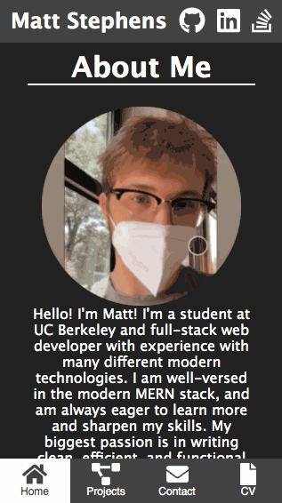

# [Matt Stephens Portfolio](https://mstephen19.github.io/react-portfolio)

A portfolio built entirely in React, utilizing state, context, and props.

This site is responsive, and has been tested on various screen sizes and mobile devices.



## Built With

- [React](https://reactjs.org/)
- [Javascript](https://developer.mozilla.org/en-US/docs/Web/JavaScript)
- [React Reveal](https://www.react-reveal.com/)
- [MaterialUI](https://mui.com/)
- [EmailJS](https://www.emailjs.com/)
- [FontAwesome](https://fontawesome.com)
- [CSS](https://developer.mozilla.org/en-US/docs/Web/CSS)

## Notable Features

### Language Toggle

```JavaScript
// App.js
export const LangContext = createContext();

// Inside App component
const [lang, setLang] = useState('en');
const toggleLang = () => {
  setLang((prevLang) => (prevLang === 'en' ? 'ru' : 'en'));
  lang === 'en'
    ? document.querySelector('html').setAttribute('lang', 'en')
    : document.querySelector('html').setAttribute('lang', 'ru');
};

return (
  <LangToggle onClick={toggleLang} />
)
```

### Responsive widths and font sizes using clamp()

```CSS
/* Example in contact.css */
.contactContainer input,
textarea {
  width: clamp(200px, 75%, 800px);
  font-size: clamp(1.25rem, 5vw, 3rem);
  background: var(--main);
  border: 1px solid black;
  border-radius: 5px;
}
```

## Live deployed link

- [Check out the site here](https://mstephen19.github.io/my-portfolio)

## Created by

**Matt Stephens**

- [Link to Portfolio Site](https://mstephen19.github.io/newestPortfolio)
- [Link to Github](https://github.com/mstephen19)
- [Link to LinkedIn](https://www.linkedin.com/mstephen19)

### Acknowledgments

- Shoutout to [Jesse Lewis](https://www.linkedin.com/in/jesseaustinlewis/) for teaching me about component lifecycles and context within React
